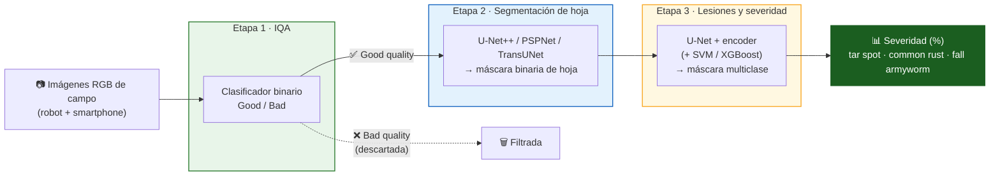

<div align="center">

# 🌽 From Field to Pixel

### Pipeline de Deep Learning para Curación Automatizada de Imágenes, Segmentación de Hoja y Cuantificación de Enfermedades y Daño por Plagas en Maíz

[](#)
[](#)
[](#)
[](#)
[](#-licencia)
[](#)

**Xception 97.4% acc · U-Net++ (ResNet34) IoU 0.92 · U-Net+ResNet34+XGBoost F1 0.84**
**↓47.1% MAE · ↓54.9% RMSE · ↓~12% emisiones CO₂eq**

</div>

---

## 📑 Tabla de contenidos

- [Resumen](#-resumen)
- [Arquitectura del pipeline](#-arquitectura-del-pipeline)
- [Resultados clave](#-resultados-clave)
  - [Etapa 1 — Evaluación de calidad de imagen (IQA)](#etapa-1--evaluación-de-calidad-de-imagen-iqa)
  - [Etapa 2 — Segmentación de hoja](#etapa-2--segmentación-de-hoja)
  - [Etapa 3 — Segmentación de lesiones y severidad](#etapa-3--segmentación-de-lesiones-y-cuantificación-de-severidad)
  - [Validación integral (end-to-end)](#-validación-integral-end-to-end)
- [Dataset](#-dataset)
- [Estructura del repositorio](#-estructura-del-repositorio-sugerida)
- [Instalación](#-instalación)
- [Uso rápido](#-uso-rápido)
- [Métricas y sostenibilidad](#-métricas-y-sostenibilidad)
- [Limitaciones y trabajo futuro](#-limitaciones-y-trabajo-futuro)
- [Cómo citar](#-cómo-citar)
- [Autores](#-autores)
- [Licencia y disponibilidad de datos](#-licencia)

---

## 🧭 Resumen

El fenotipado de campo basado en imágenes RGB depende de fuentes heterogéneas (robots terrestres, smartphones), pero el valor de esos flujos de imágenes se ve comprometido por una adquisición no controlada: desenfoque, iluminación variable, oclusiones y fondos complejos sesgan las estimaciones de severidad, mientras que la curación manual experta es lenta, subjetiva e insostenible a gran escala.

Este repositorio contiene un **flujo de trabajo de deep learning en tres etapas**, validado con imágenes RGB multitemporales de **2 países, 6 sitios, estadios V4–R6**, adquiridas con plataforma robótica y smartphones, para:

1. **Filtrar automáticamente** imágenes degradadas (IQA).
2. **Segmentar la hoja de maíz** y aislarla de fondos de campo complejos.
3. **Segmentar y cuantificar** la severidad de *tar spot*, roya común (*common rust*) y daño por gusano cogollero (*fall armyworm*).

En lugar de fijar un modelo de antemano, se compararon múltiples arquitecturas por etapa bajo particiones idénticas, reportando **costo computacional y ambiental** junto con la exactitud — siguiendo el marco de *Green AI*.

> 💡 **Resultado principal:** el pipeline integrado (IQA + segmentación + detección) redujo el **MAE macro en 47.1%** y el **RMSE en 54.9%** frente al análisis sin filtrar, con **sesgo casi nulo** y **~12% menos emisiones de CO₂eq** en la etapa de detección — sin aumentar el tiempo de inferencia.

---

## 🧩 Arquitectura del pipeline



| Etapa | Objetivo | Mejor modelo | Métrica principal |
|:--|:--|:--|:--:|
| **1 · IQA** | Filtrar imágenes degradadas | **Xception** | 97.4% accuracy |
| **1 · IQA (eficiencia)** | Alternativa liviana | **YOLOv11n-cls** | 93.0% acc · ↓98.9% CO₂ |
| **2 · Segmentación de hoja** | Aislar tejido foliar | **U-Net++ (ResNet34)** | IoU 0.876–0.923 |
| **3 · Lesiones/severidad** | Cuantificar daño multiclase | **U-Net+ResNet34+XGBoost** | F1 0.838 · IoU 0.723 |

---

## 📊 Resultados clave

### Etapa 1 · Evaluación de calidad de imagen (IQA)

Se evaluaron 6 arquitecturas (ResNet50, DenseNet201, InceptionV3, Xception, YOLOv8n-cls, YOLOv11n-cls) sobre 7,912 imágenes (70/15/15) para separar imágenes analizables de degradadas (desenfoque, mala exposición, encuadre inadecuado).

<p align="center">
  
</p>

<p align="center">
  
</p>

- **Xception** logró la clasificación más balanceada (1,163/1,194 correctas · 97.4% acc) y **redujo el tiempo de curación en 99.78%** frente a 5 evaluadores humanos (446× más rápido).
- **YOLOv11n-cls** ofrece el mejor equilibrio eficiencia-exactitud: **↓98.95% CO₂/época** y **↓98.52% energía** respecto a Xception, manteniendo 93.0% de exactitud.

<details>
<summary>📋 Ver tabla completa — Etapa 1</summary>

| Modelo | Precisión | Accuracy | Recall | F1 | CO₂/época (g) | Energía (kWh) | Inferencia (s/img) |
|:--|:--:|:--:|:--:|:--:|:--:|:--:|:--:|
| DenseNet201 | 0.914 | 0.910 | 0.910 | 0.910 | 91.797 | 0.226 | 0.014 |
| ResNet50 | 0.925 | 0.925 | 0.925 | 0.925 | 34.073 | 0.089 | 0.009 |
| InceptionV3 | 0.900 | 0.892 | 0.899 | 0.899 | 141.290 | 0.351 | 0.007 |
| **Xception** ⭐ | **0.974** | **0.974** | **0.975** | **0.974** | 296.748 | 0.742 | 0.015 |
| YOLOv8n-cls | 0.921 | 0.919 | 0.920 | 0.919 | 4.356 | 0.013 | 0.062 |
| **YOLOv11n-cls** 🌱 | 0.932 | 0.930 | 0.931 | 0.930 | **3.103** | **0.011** | 0.063 |

</details>

---

### Etapa 2 · Segmentación de hoja

Cuatro arquitecturas fueron evaluadas (660 imágenes, 75/15/10) bajo dos subconjuntos de prueba: **fondos con ruido** y **variación fenológica** (V4–R6).

<p align="center">
  
</p>

- **U-Net++ (ResNet34)** obtuvo la delineación más robusta en ambos escenarios (IoU 0.876 y 0.923).
- **TransUNet** fue competitivo bajo variación fenológica (IoU 0.843) pero con mayor costo de entrenamiento y *batch size* limitado a 2.
- **PSPNet** mostró la mayor caída de desempeño ante fondos ruidosos y baja variabilidad fenológica, consistente con la limitación conocida del *pyramid pooling* para capturar bordes finos.

<details>
<summary>📋 Ver tabla completa — Etapa 2</summary>

**Fondo con ruido**

| Modelo | Precisión | Accuracy | Recall | F1 | IoU | Inferencia (s/img) |
|:--|:--:|:--:|:--:|:--:|:--:|:--:|
| **U-Net++ (ResNet34)** ⭐ | 0.887 | 0.978 | 0.988 | 0.931 | **0.876** | 0.015 |
| U-Net++ (MobileNet) | 0.907 | 0.957 | 0.776 | 0.814 | 0.728 | 0.016 |
| PSPNet (ResNet34) | 0.705 | 0.928 | 0.887 | 0.779 | 0.661 | 0.006 |
| TransUNet | 0.953 | 0.978 | 0.913 | 0.929 | 0.873 | 0.026 |

**Variación fenológica**

| Modelo | Precisión | Accuracy | Recall | F1 | IoU | Inferencia (s/img) |
|:--|:--:|:--:|:--:|:--:|:--:|:--:|
| **U-Net++ (ResNet34)** ⭐ | 0.948 | 0.990 | 0.962 | 0.947 | **0.923** | 0.009 |
| U-Net++ (MobileNet) | 0.973 | 0.967 | 0.731 | 0.792 | 0.716 | 0.010 |
| PSPNet (ResNet34) | 0.885 | 0.932 | 0.508 | 0.606 | 0.494 | 0.003 |
| TransUNet | 0.874 | 0.966 | 0.934 | 0.889 | 0.843 | 0.061 |

</details>

---

### Etapa 3 · Segmentación de lesiones y cuantificación de severidad

Se compararon 4 codificadores (ResNet34, ResNet50, EfficientNet-B3, DenseNet-121) y 2 modelos híbridos (**+SVM**, **+XGBoost**) que fusionan características profundas con descriptores manuales (LBP, histogramas de color, geometría de lesión) sobre 7,889 anotaciones de *tar spot*, *common rust* y *fall armyworm* (fuerte desbalance de clases).

<p align="center">
  
</p>

> ⚠️ **Hallazgo clave:** bajo fuerte desbalance de clases, la exactitud de píxel (PA) puede superar 0.99 mientras el F1-score cae por debajo de 0.42 — la PA **enmascara** el fallo casi total en detectar la clase minoritaria (lesión). El **F1-score** y el **IoU** deben usarse como criterios primarios.

- **U-Net+ResNet34+XGBoost** ⭐ fue el modelo seleccionado: mejor F1 (0.838) e IoU (0.723) pese a tener menor PA que los modelos estándar.
- El modelo híbrido con **SVM** fue el segundo mejor, con confusión persistente entre *common rust* y *tar spot*.

<details>
<summary>📋 Ver tabla completa — Etapa 3</summary>

| Modelo | Precisión | PA | Recall | F1 | IoU | CO₂/época (g) | Inferencia (s/img) |
|:--|:--:|:--:|:--:|:--:|:--:|:--:|:--:|
| U-Net + ResNet34 | 0.338 | 0.990 | 0.477 | 0.393 | 0.250 | 14.514 | 0.029 |
| U-Net + ResNet34 + SVM | 0.793 | 0.759 | 0.714 | 0.694 | 0.560 | 15.829 | 0.567 |
| **U-Net + ResNet34 + XGBoost** ⭐ | **0.841** | 0.882 | **0.870** | **0.838** | **0.723** | 15.012 | 0.433 |
| U-Net + ResNet50 | 0.398 | 0.992 | 0.552 | 0.414 | 0.280 | 33.834 | 0.038 |
| U-Net + EfficientNet-B3 | 0.503 | 0.993 | 0.382 | 0.379 | 0.251 | 15.655 | 0.058 |
| U-Net + DenseNet-121 | 0.330 | 0.991 | 0.475 | 0.318 | 0.215 | 11.441 | 0.036 |

</details>

---

## 🔗 Validación integral (end-to-end)

Se comparó el flujo **directo** (sin filtrado) frente al **pipeline integrado** (IQA + segmentación de hoja) contra tres referencias: anotación manual por polígonos (*ground truth*), evaluación visual de 15 evaluadores y las predicciones automatizadas.

<p align="center">
  
</p>

<p align="center">
  
</p>

| Método | Tar spot (%) | Common rust (%) | Fall armyworm (%) | Macro-MAE (pp) | MBE (pp) | RMSE (pp) | CCC |
|:--|:--:|:--:|:--:|:--:|:--:|:--:|:--:|
| Anotación manual (referencia) | 1.744 | 0.513 | 0.300 | — | — | — | — |
| Evaluación visual (n=15) | 8.840 | 7.861 | 7.738 | 7.294 | +7.294 | 7.295 | 0.012 |
| Flujo directo (sin filtrado) | 0.028 | 0.086 | 0.290 | 0.718 | −0.718 | 1.021 | −0.117 |
| **Pipeline integrado** ⭐ | **1.346** | **0.457** | **0.987** | **0.380** | **+0.078** | **0.460** | **0.612** |

- Los evaluadores humanos **sobreestiman sistemáticamente** la severidad (+7.3 pp de sesgo promedio); el flujo sin filtrar **subestima** las enfermedades fúngicas.
- El pipeline integrado **reduce el MAE en 47.1%** y el **RMSE en 54.9%** frente al flujo directo, y **94.8%/93.7%** frente a la evaluación visual — con sesgo casi nulo (+0.078 pp).
- El filtrado previo (IQA + segmentación) reduce ~**12% las emisiones de CO₂eq** en la etapa de detección, sin penalizar el tiempo de inferencia (9.17 vs 9.33 s/imagen).

---

## 🗂️ Dataset

| | |
|:--|:--|
| **Periodo de adquisición** | 2024–2026 |
| **Países / sitios** | 🇺🇸 EE. UU. (Indiana: PPAC, Benton County) · 🇨🇴 Colombia (Marengo, Bogotá, Donmatías ×2) |
| **Estadios fenológicos** | V4–V10, R1–R6 |
| **Plataformas** | Robot Solinftec (manual/autónomo) + smartphones (Motorola G Play, iPhone 13/16) |
| **Total de imágenes** | > 8,500 RGB |
| **Anotación de lesiones** | Label Studio — polígonos (7,889 anotaciones: 3,842 tar spot · 3,475 common rust · 572 fall armyworm) |

> ⚠️ Por restricciones de confidencialidad, el conjunto de imágenes adquirido con la plataforma robótica **no puede compartirse públicamente**. Consulta la sección [Licencia y disponibilidad de datos](#-licencia).

---

## 📁 Estructura del repositorio (sugerida)

```
Field_to_Pixel/
├── assets/                     # Gráficas e imágenes usadas en este README
├── data/                       # Datos públicos / enlaces a datasets (ver restricciones)
├── notebooks/                  # Notebooks exploratorios
├── src/
│   ├── stage1_iqa/             # Clasificación de calidad de imagen
│   ├── stage2_leaf_seg/        # Segmentación de hoja (U-Net++, PSPNet, TransUNet)
│   ├── stage3_lesion_seg/      # Segmentación de lesiones + modelos híbridos
│   └── utils/                  # Preprocesamiento, augmentación, métricas
├── models/                     # Checkpoints entrenados
├── configs/                    # Configuraciones de entrenamiento por arquitectura
├── results/                    # Tablas, curvas de aprendizaje, matrices de confusión
├── requirements.txt
└── README.md
```

> ℹ️ Ajusta esta estructura a la organización real de tu repositorio.

---

## ⚙️ Instalación

```bash
# 1. Clonar el repositorio
git clone https://github.com/agrocompepidemlab/Field_to_Pixel.git
cd Field_to_Pixel

# 2. Crear entorno virtual
python3.10 -m venv venv
source venv/bin/activate      # En Windows: venv\Scripts\activate

# 3. Instalar dependencias
pip install -r requirements.txt
```

<details>
<summary>📦 Dependencias principales</summary>

- Python 3.10
- PyTorch + torchvision
- Ultralytics (YOLOv8n-cls, YOLOv11n-cls)
- CodeCarbon ≥ 2.3 (seguimiento de emisiones)
- psutil ≥ 5.9 (monitoreo de recursos)
- NumPy ≥ 1.24 · pandas ≥ 2.0 · scikit-learn ≥ 1.3 · Matplotlib ≥ 3.7

</details>

---

## 🚀 Uso rápido

```bash
# Etapa 1 — Filtrar imágenes por calidad
python src/stage1_iqa/predict.py --input data/raw_images/ --model xception --output data/filtered/

# Etapa 2 — Segmentar hoja de maíz
python src/stage2_leaf_seg/predict.py --input data/filtered/ --model unetpp_resnet34 --output data/leaf_masks/

# Etapa 3 — Segmentar lesiones y cuantificar severidad
python src/stage3_lesion_seg/predict.py --input data/leaf_masks/ --model unet_resnet34_xgboost --output results/severity.csv
```

> Los nombres de scripts y argumentos son orientativos — reemplázalos por los correspondientes a la implementación real de este repositorio.

---

## 🌱 Métricas y sostenibilidad

Cada etapa registra métricas de **costo computacional y ambiental** con [CodeCarbon](https://github.com/mlco2/codecarbon) (energía en kWh, CO₂eq en g/época) y monitoreo de recursos con `psutil` (uso de GPU, VRAM, CPU, RAM, I/O de disco cada 5 s), siguiendo el marco **Green AI**: reportar eficiencia computacional como criterio de evaluación de primer orden, no como nota al margen.

| Indicador | Flujo directo | Pipeline integrado | Cambio |
|:--|:--:|:--:|:--:|
| Macro-MAE (pp) | 0.718 | **0.380** | ↓ 47.1% |
| RMSE (pp) | 1.021 | **0.460** | ↓ 54.9% |
| CO₂eq detección (g/img) | 0.212 | **0.187** | ↓ ~12% |
| Tiempo inferencia (s/img) | 9.326 | 9.169 | ≈ igual |

---

## 🔭 Limitaciones y trabajo futuro

- El conjunto de prueba de la Etapa 3 es pequeño (n=586), lo que limita la robustez estadística de las comparaciones.
- Todos los modelos se entrenaron y evaluaron con imágenes RGB de una sola temporada y tres localidades.
- Las estimaciones de CodeCarbon tienen una incertidumbre reportada de hasta 40% según hardware e intensidad de carbono de la red eléctrica.

**Próximos pasos:**
- [ ] Ampliar el conjunto anotado de la Etapa 3 a múltiples temporadas y sitios.
- [ ] Incorporar imágenes hiperespectrales/multiespectrales para mejorar la discriminación en estadios tempranos.
- [ ] Explorar aprendizaje autosupervisado/semisupervisado para reducir la carga de anotación.

---

## 📖 Cómo citar

Si usas este repositorio o los resultados del artículo, por favor cita:

```bibtex
@article{hernandez_field_to_pixel,
  title   = {From Field to Pixel: A Deep Learning Pipeline for Automated Image Curation,
             Leaf Segmentation, and Quantification of Disease and Pest Damage in Maize},
  author  = {Hernández Azuero, Stefania and Flores Riera, Jesús Enrique and
             Santos Suarez, Emanuel David and Gongora Canul, Carlos and
             Cruz, Christian D. and Ramírez Gil, Joaquín Guillermo},
  journal = {Preprint / Journal TBD},
  year    = {2026}
}
```

---

## 👥 Autores

| Autor/a | Afiliación |
|:--|:--|
| Stefania Hernández Azuero | Universidad Nacional de Colombia, Sede Bogotá |
| Jesús Enrique Flores Riera | Universidad Nacional de Colombia, Sede Bogotá |
| Emanuel David Santos Suarez | Purdue University |
| Carlos Gongora Canul | Purdue University |
| Christian D. Cruz | Purdue University |
| Joaquín Guillermo Ramírez Gil ✉️ | Universidad Nacional de Colombia, Sede Bogotá |

📧 Contacto: [jgramireg@unal.edu.co](mailto:jgramireg@unal.edu.co)

---

## 🔐 Licencia

- **Código:** especifica aquí la licencia de este repositorio (p. ej. MIT, Apache-2.0).
- **Datos:** disponibles en este repositorio, **excepto** el conjunto adquirido con la plataforma robótica, que no puede compartirse públicamente por restricciones de confidencialidad.
- **Financiamiento:** proyecto *"PARTNERSHIP Agricultural Biosecurity: Advancing Corn Pathology Research and Biosecurity Enhancement"*, colaboración Universidad Nacional de Colombia–Purdue University.

<div align="center">

---

Hecho con 🌽 por el **Laboratorio de Agrocomputación y Análisis Epidemiológico** — Universidad Nacional de Colombia

</div>
